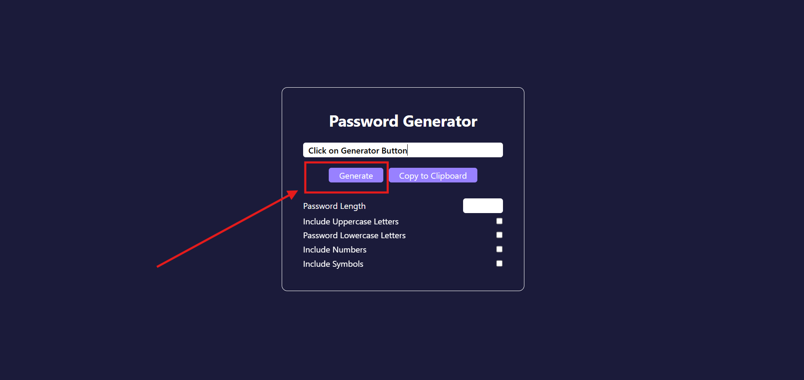
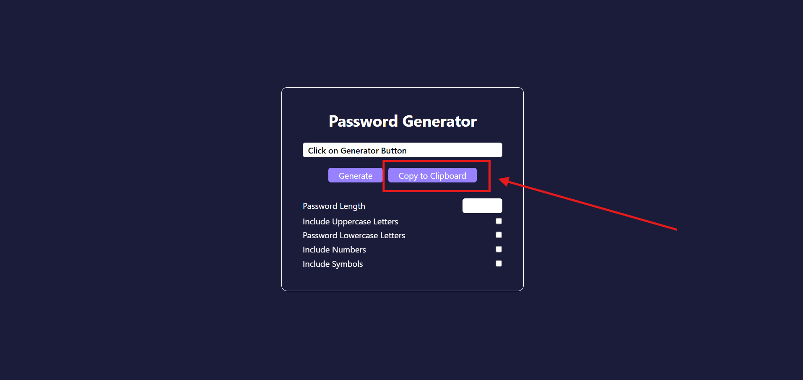

# 🔐 Password Generator

A simple and customizable **Password Generator** built using **HTML**, **Tailwind CSS**, and **JavaScript**.  
Users can select options like **uppercase letters**, **lowercase letters**, **numbers**, and **symbols** to generate strong, random passwords of their desired length.

---

## 🚀 Features
- Generate random passwords of any length
- Include:
  - Uppercase letters (A-Z)
  - Lowercase letters (a-z)
  - Numbers (0-9)
  - Symbols (!@#$%^&* etc.)
- Copy the generated password to the clipboard with a single click
- User-friendly and lightweight

---

## 🛠️ Technologies Used
- HTML5
- CSS3
- JavaScript (Vanilla JS)

---

## 📸 Screenshots

| Generate Password | Copy to Clipboard |
|:-----------------:|:-----------------:|
|  |  |

---

## 🧩 How It Works

1. Enter the desired **password length**.
2. Select character types:
   - Uppercase
   - Lowercase
   - Numbers
   - Symbols
3. Click **"Generate Password"**.
4. Click **"Copy Password"** to copy it to your clipboard.

---

## 📂 Project Structure

\`\`\`bash
📁 Password-Generator/
 ┣ 📄 index.html
 ┣ 📄 style.css
 ┗ 📄 script.js
\`\`\`

---

## ✨ Live Demo

👉 [Live Preview Here](https://codewithshambhu.github.io/password-generator/)

---

## 📋 How to Run Locally

1. Clone this repository:
   \`\`\`bash
   git clone https://github.com/CodeWithShambhu/password-generator.git
   \`\`\`
2. Navigate to the project directory:
   \`\`\`bash
   cd password-generator
   \`\`\`
3. Open `index.html` in your browser.

---

## 🙌 Contributing

Contributions, issues, and feature requests are welcome!  
Feel free to **fork** the repo and create a **pull request**.

---

## 💬 Connect with Me

- GitHub: [CodeWithShambhu](https://github.com/CodeWithShambhu)
- LinkedIn: [Shambhu-Sk](https://www.linkedin.com/in/shambhu-sk/)

---

# 🔥 Happy Password Generating! 🔥
